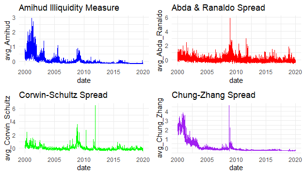

# liquidity-project

Assessing the liquidity of daily stock returns based on 4 liquidity measures.  
This project analyzes and compares four widely-used liquidity measures for U.S. stocks, focusing on their behavior across time and correlation patterns across firms.

To assess how various liquidity proxies relate to each other both cross-sectionally (across stocks) and temporally (over time), the measures included are:

- **Amihud Illiquidity (2002)**
- **Abda and Ranaldo Spread**
- **Corwin and Schultz Spread (2012)**
- **Chung and Zhang Spread (2014)**

The dataset (`liquidity.csv`) contains daily stock data including prices, volume, bid/ask prices, and returns.

The plot shows consistent across different measures illiquidity spikes during the 2007 financial crisis:

